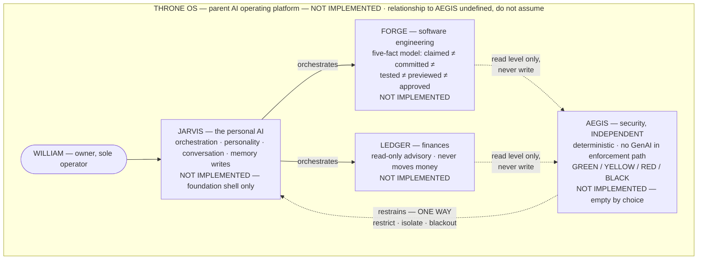
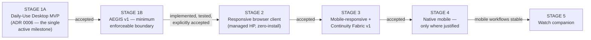
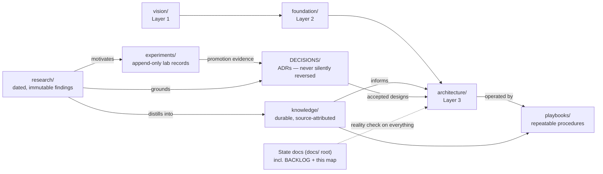
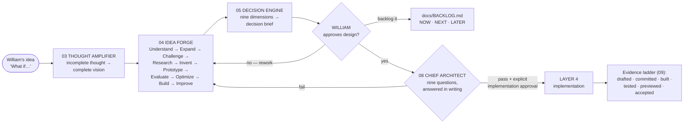

# JARVIS MASTER BLUEPRINT — the visual architecture map

- **Category:** State (docs root) — this map carries status claims, which the
  architecture category forbids; reality reporting belongs here.
- **Status:** reconciled 2026-07-17 (ADR 0005, ADR 0006). Rendered visual version:
  published artifact "Jarvis Master Blueprint" (same content, same source of truth).
- **Audience:** humans and AI coding agents. If you are an AI agent: read `CLAUDE.md`
  first, then this map. GitHub is the source of truth, not this map.

> **READ THIS BEFORE THE DIAGRAMS.** This is a map of the *intended* system. Almost
> nothing on it exists. The only running software is a hardened Electron shell with one
> IPC channel (`app:get-info`). Every box marked CONCEPTUAL or NOT IMPLEMENTED is a
> name and an intent — **this map is never authorization to build any of it**
> (Layer rule 2; ADR 0004; `docs/foundation/09-COMPLETION-DOCTRINE.md`). The honest
> inventory is `docs/KNOWN-LIMITATIONS.md`; priorities live in `docs/BACKLOG.md`.

---

## 1. The four layers

Vision, Foundation, Architecture, and Implementation are intentionally separated.
Documents govern downward; approval is required at every transition; the Chief
Architect gate guards the last one. Security outranks all four layers from the side.
**Evolution is not a fifth layer** — it is a governed lifecycle operating across all
four, through the Evolution Engine, experiments, evaluations, ADRs, approvals, and
versioned promotion.

```mermaid
flowchart TB
    SEC["SECURITY AUTHORITY — outranks every layer<br/>reference/design-handoff/ (immutable) · surfaced via 07-SECURITY-REFERENCE<br/>Jarvis never controls AEGIS. AEGIS can restrict Jarvis."]

    subgraph L1["LAYER 1 — VISION · docs/vision/ · changes very rarely · authored only by William"]
        OO["OWNER-OBJECTIVES.md — DRAFT<br/>protect livelihood · exceptional at profession ·<br/>reusable businesses · recover time ·<br/>ethical sustainable wealth · freedom over complexity"]
        NS["NORTH-STAR.md — CONCEPTUAL, from an interview with William, seeded by OWNER-OBJECTIVES<br/>mission · 5-year vision · core objectives ·<br/>success definition · strategic priorities · anti-goals"]
    end

    subgraph L2["LAYER 2 — FOUNDATION · docs/foundation/ · how Jarvis thinks, learns, decides"]
        direction LR
        F1["01 CONSTITUTION<br/>APPROVED"]
        F2["02 PHILOSOPHY-ENGINE<br/>DRAFT"]
        F3["03 THOUGHT-AMPLIFIER<br/>CONCEPTUAL"]
        F4["04 IDEA-FORGE<br/>CONCEPTUAL"]
        F5["05 DECISION-ENGINE<br/>CONCEPTUAL"]
        F6["06 MEMORY-CONSTITUTION<br/>CONCEPTUAL"]
        F7["07 SECURITY-REFERENCE<br/>DRAFT · pointer only"]
        F8["08 CHIEF-ARCHITECT<br/>CONCEPTUAL"]
        F9["09 COMPLETION-DOCTRINE<br/>DRAFT"]
    end

    subgraph L3["LAYER 3 — ARCHITECTURE · docs/architecture/ · system designs, zero code, all CONCEPTUAL"]
        direction LR
        A1["agent-factory<br/>(Executive Council pattern)<br/>+ agents/&lt;name&gt;/"]
        A2["jarvis-academy ·<br/>mentor-dna"]
        A3["evolution-engine ·<br/>innovation-lab"]
        A4["venture-studio ·<br/>living-universe"]
        A5["forge · ledger · aegis<br/>(pointer-built on handoff)"]
        A6["ui-architecture ·<br/>api-architecture"]
        A7["client-architecture ·<br/>continuity-fabric ·<br/>device-trust-model"]
        A8["desktop-client · mobile-client ·<br/>watch-companion · browser-client"]
    end

    subgraph L4["LAYER 4 — IMPLEMENTATION · code + state docs · changes continuously"]
        direction LR
        I1["apps/desktop — PARTIAL<br/>hardened shell, 1 IPC channel"]
        I2["packages/config — IMPLEMENTED<br/>packages/database — PARTIAL"]
        I3["services/jarvis-core — EMPTY<br/>services/aegis — EMPTY BY CHOICE"]
        I4["State docs: CURRENT-STATE-AUDIT ·<br/>KNOWN-LIMITATIONS · IPC-SURFACE ·<br/>BACKLOG · this map"]
    end

    SEC -.-> L1
    L1 -->|"governs — never authorizes"| L2
    L2 -->|"governs — never authorizes"| L3
    L3 -->|"CHIEF ARCHITECT GATE<br/>9 questions + explicit approval by William"| L4
```

**The four rules:** lower layers conform to higher ones · higher layers never authorize
lower-layer work · no layer skipping · every document declares its layer.

## 2. The ecosystem — who owns what, who restrains whom

The two rules that override everything: **Jarvis never controls AEGIS. AEGIS can
restrict Jarvis.** Jarvis may request a *stricter* level, never a looser one. Full
contract: the immutable handoff, via `07-SECURITY-REFERENCE.md`.

Also chartered, all NOT IMPLEMENTED: BCI Agent, Sophisticated Sips (Amy Lavold —
multi-user model undefined), Vanguard Performance Labs and Peptastic (regulated
domains, boundaries undefined), Saltline.

## 3. The clients — one Jarvis, four coordinated interfaces

**Jarvis is an anywhere-accessible, multi-client platform** (ADR 0005): desktop,
mobile, watch, and browser are interfaces to **one governed Jarvis identity**, never
separate Jarvis systems. All client documents are CONCEPTUAL; nothing below is built or
authorized. Full charters: `docs/superpowers/specs/2026-07-17-cross-device-architecture.md`.

| Interface | Role | Trust example | Status |
|---|---|---|---|
| **Desktop** | Full command center — deep work, approvals, supervision | Personal Dell: full client | Shell exists (PARTIAL); everything else CONCEPTUAL |
| **Mobile** | Portable Jarvis — voice, capture, approvals, Drive Mode | Only the permissions its workflows need | CONCEPTUAL — permanent commitment, outside the MVP |
| **Watch** | Glanceable rapid response — never duplicates desktop | Minimal permission set | CONCEPTUAL — after mobile is stable |
| **Browser** | Zero-install access for managed computers | Managed HP: browser only, visible trust level, no assumed local access | CONCEPTUAL — **gated behind AEGIS v1 (F15 ruling)** |

**Continuity Fabric** (CONCEPTUAL — no sync infrastructure authorized) is the
connective tissue: shared identity, synchronized context, device handoff, pending
approvals, notification routing, offline queues, device security posture.

**The staged sequence (F15 ruling — AEGIS v1 before any remote surface):**

## 4. The document library — where knowledge lives and how it flows

| Category | One rule that keeps it honest |
|---|---|
| `vision/` | Only William authors it; cites nothing below it |
| `foundation/` | Behaviors only, never system designs; security by pointer only |
| `architecture/` | Designs only, never code or status claims |
| `knowledge/` | Only evidence-grade material graduates here, always source-attributed |
| `playbooks/` | Must be followable as steps; CONCEPTUAL if the system isn't built |
| `research/` | Date-prefixed, immutable once concluded — new finding, new file |
| `experiments/` | Append-only, failures included |
| `DECISIONS/` | Every category points into it; nothing reversed silently |
| State (docs root) | Describes what IS — never what's intended |

## 5. The decision pipeline — how an idea becomes software

Three checklists at three altitudes: Idea Forge governs ideas, the Decision Engine
governs recommendations, the Chief Architect governs implementations. The **Completion
Doctrine** (09) governs the whole loop: one milestone at a time; new ideas go to
`docs/BACKLOG.md`, never into active work; ship before expanding.

Escalation is a first-class outcome: anything touching money, legal exposure, security
boundaries, other people, or irreversibility goes to William **undecided**.

## 6. What exists today (2026-07-17) — the honest inventory

| Component | Status |
|---|---|
| Electron shell, hardened (contextIsolation, CSP, sandbox) | IMPLEMENTED AND VERIFIED — dev runtime; packaged installer pending |
| Typed IPC boundary — one channel, `app:get-info` | IMPLEMENTED AND VERIFIED — dev runtime |
| `packages/config` (env + logging) | IMPLEMENTED, unit-tested |
| `packages/database` (migration runner) | PARTIAL — zero migrations |
| Foundation docs 01 · 02 · 07 · 09 | 01 APPROVED; 02, 07, 09 DRAFT |
| ADRs 0001–0006 · `docs/BACKLOG.md` · this map | Committed documentation |
| Daily-Use MVP (Stage 1A, ADR 0006) | **Defined — implementation NOT started, awaiting explicit approval** |
| **Everything else on this map** | **CONCEPTUAL / NOT IMPLEMENTED** |

## 7. How to use this map (for AI coding agents)

1. Read `CLAUDE.md` first — it is the operating manual and overrides this map.
2. This map shows intent. `docs/KNOWN-LIMITATIONS.md` shows reality. When they differ,
   reality wins and the map must say so.
3. A box on this map is never authorization to build it. Every layer transition
   requires William's explicit approval, and Layer 3 → 4 additionally requires the
   Chief Architect review.
4. One milestone at a time (`09-COMPLETION-DOCTRINE.md`). New ideas go to
   `docs/BACKLOG.md` — never into active work.
5. Never restate a security rule from this map — cite `07-SECURITY-REFERENCE.md`.
6. If you change the architecture, update this map (and its published artifact) in the
   same change — a stale blueprint on this project is a security risk, because the
   boundaries are the architecture.
